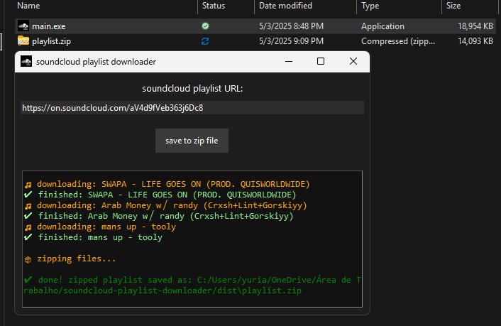

<h1 align="center">
  🎵 soundcloud playlist downloader 🎵
</h1>
<p align="center">
  
</p>
<p align="center">
  <strong>python-based tool to download soundcloud playlists or individual tracks (public or private)</strong>
</p>
<p align="center">
  
</p>

## features

- supports both private and public links
- downloads all audio files into a single zip file to ease organization
- simple interface

## getting started
### prerequisites
- python 3.6 or higher  
- `pip` package manager  
- **[ffmpeg](https://www.gyan.dev/ffmpeg/builds/)** - needs to be installed and added to system path manually
- **[yt-dlp](https://github.com/yt-dlp/yt-dlp)**

### usage

####  run from terminal (for development)
```bash
python main.py
```

#### build .exe 
use [pyinstaller](https://pyinstaller.org/) to create a standalone executable:
```bash
pyinstaller --onefile --windowed --icon=helper/sc.ico --add-data "helper/sc.ico;helper" main.py
```
